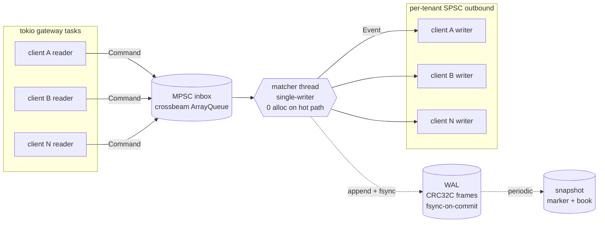

# bourse

A limit order book matching engine in Rust.
[Source on GitHub →](https://github.com/pauti04/bourse)

> A learning portfolio piece. Single-instrument, price-time priority,
> length-prefixed binary protocol over TCP, write-ahead log with
> byte-exact replay, lock-free SPSC queue between the gateway and the
> matcher.

## Headline numbers

End-to-end on M-series silicon, single matcher thread, single TCP
connection, release build:

```
in-process round-trip            ~225 ns
TCP round-trip (loopback) p50    ~45 µs
TCP round-trip (loopback) p99    ~109 µs
TCP throughput (pipelined)       ~118 k orders/sec
matcher walks 1000 levels        ~94 µs (≈10 M trades/sec)
WAL group commit speedup         187× to 245×
SPSC push+pop                    ~5.3 ns
```

## Architecture



The matcher itself runs on one dedicated thread — single-writer,
no contention to design around. The lock-free primitives are the
queues at the boundaries; that's where `unsafe`, the `// SAFETY:`
proofs, and Miri validation live.

## Live demo (real captured run)

```
$ bourse-client 127.0.0.1:9000 2000 20000
RTT (sequential):
  samples: 2000
  p50:     78542 ns
  p90:     112125 ns
  p99:     307334 ns
  p99.9:   782500 ns
throughput (pipelined burst, 20k orders):
  87616 orders/sec, 43808 round-trips/sec
```

## Write-ups

Three long-form posts on the design decisions, tied directly to the
working code:

- [**Designing the bourse lock-free SPSC queue**](posts/lock-free-spsc.html)
  — cache padding, cached views, Acquire/Release ordering, and
  validating the whole thing with Miri in CI.
- [**Crash-safe matching: WAL and byte-exact replay**](posts/wal-and-byte-exact-replay.html)
  — CRC32C-framed records, truncation tolerance, snapshots, and the
  10 k-order integration test that proves recovery is bit-equal to
  the live engine.
- [**bourse numbers, and how they were measured**](posts/numbers-and-methodology.html)
  — what each headline number actually measures, where the bench
  code is, and what we don't claim.

## What's built

| Subsystem | Status |
| --- | --- |
| Core types (`Price` fixed-point i64, `OrderId`, `Sequence`, `Side`, `Qty`, `Timestamp`) | ✅ |
| In-memory order book (`BTreeMap` per side, `HashMap` index for cancel) | ✅ |
| Matcher (Limit / Market / IOC; partial fills; lifecycle proptest) | ✅ |
| Write-ahead log (CRC32C-framed records, fsync-on-commit, **byte-exact replay** test on 10 k random orders) | ✅ |
| Lock-free SPSC ring buffer (Acquire/Release with `// SAFETY:` proofs, **Miri-validated in CI**) | ✅ |
| End-to-end engine (matcher on a dedicated thread, lock-free queues at the boundaries) | ✅ |
| Hand-rolled binary wire protocol codec | ✅ |
| TCP server + multi-tenant `Hub` (one matcher across many connections) | ✅ |
| Load-gen client with RTT + throughput histogram | ✅ |
| Snapshots + byte-exact recovery test | ✅ |
| `bourse-replay` recovery binary | ✅ |
| Allocation-counting test harness — **machine-verifies zero alloc on hot path** | ✅ |

## What I learned

- **Memory ordering isn't intuition.** Walking through the
  Acquire/Release happens-before argument by hand was the first time
  I felt I actually understood the C++20 memory model. Miri catching
  subtle ordering bugs locally — before they ever became data races
  in production — is the strongest tooling lesson.
- **"Zero alloc on the hot path" is a claim that needs a meter.**
  Built a custom-allocator harness; the gap between "I think this is
  alloc-free" and "the steady-state cross loop is 0/1000" was
  instructive.
- **Property tests find real bugs.** The matcher's lifecycle
  proptest caught two real correctness bugs while I was writing it
  — both visible in the slice 2 commit.
- **Benchmarks lie if you don't define them carefully.** My first
  TCP load-gen reported `p50 = 275 ms` because I'd built a
  closed-loop measurement that double-counted queueing delay. The
  [methodology post](posts/numbers-and-methodology.html) walks
  through what each headline number actually measures and why.
- **Versioning everything from day one is cheap.** Both the WAL and
  the snapshot file format carry a version byte from the first byte;
  bumping a version was a one-line change when I needed to add
  `wal_seq` tagging.

## CI

Every push runs: `cargo fmt --check`, `cargo clippy --all-targets -D
warnings`, `cargo test --workspace`, `cargo doc --no-deps`,
`cargo bench --no-run`, **Miri** on the lock-free modules, and a
**bench numbers** job on `ubuntu-latest` that uploads
`bench_numbers.md` as a downloadable artifact.

[Open the repo on GitHub →](https://github.com/pauti04/bourse)
