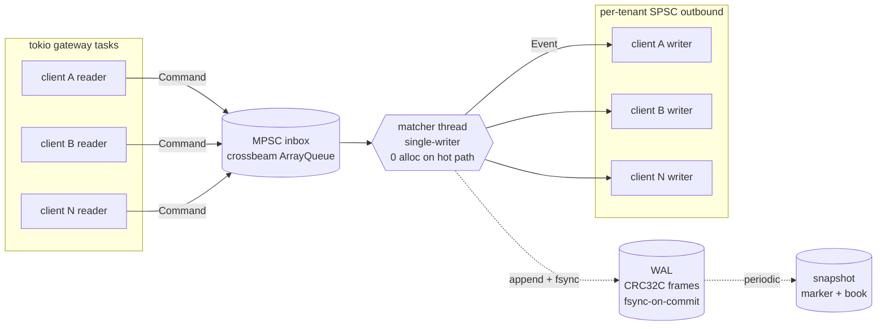

<p class="hero-badges">
  <a href="https://github.com/pauti04/bourse/actions/workflows/ci.yml"></a>
  <a href="https://github.com/pauti04/bourse/blob/main/LICENSE"></a>
  <a href="https://github.com/pauti04/bourse/blob/main/rust-toolchain.toml"></a>
</p>

A limit order book matching engine in Rust. Single-instrument,
price-time priority, length-prefixed binary protocol over TCP,
write-ahead log with byte-exact replay, lock-free SPSC queue
between the gateway and the matcher.

> **About this project.** A learning portfolio piece built to
> understand how a real matching engine is put together — not a
> production system. The goal was to make decisions an interviewer
> would push on (allocator behavior, memory ordering, durability
> semantics, benchmarking discipline) and *measure* them rather than
> hand-wave. What's here works and is tested; what's not built is
> documented honestly.

## Headline numbers

End-to-end on M-series silicon, single matcher thread, multi-tenant
Hub, release build:

<div class="numbers-grid">
  <div class="num">
    <div class="value">~225 ns</div>
    <div class="label">in-process round-trip</div>
  </div>
  <div class="num">
    <div class="value">~78 µs</div>
    <div class="label">TCP round-trip p50 (loopback)</div>
  </div>
  <div class="num">
    <div class="value">~307 µs</div>
    <div class="label">TCP round-trip p99 (loopback)</div>
  </div>
  <div class="num">
    <div class="value">~88 k/s</div>
    <div class="label">TCP throughput (pipelined)</div>
  </div>
  <div class="num">
    <div class="value">~94 µs</div>
    <div class="label">matcher walks 1000 levels (~10 M trades/s)</div>
  </div>
  <div class="num">
    <div class="value">187×–245×</div>
    <div class="label">WAL group-commit speedup vs fsync-per-record</div>
  </div>
  <div class="num">
    <div class="value">~5.3 ns</div>
    <div class="label">SPSC push+pop, Miri-validated</div>
  </div>
  <div class="num">
    <div class="value">0</div>
    <div class="label">allocs / 1000 crosses on the hot path (measured)</div>
  </div>
</div>

[How these numbers were measured →](posts/numbers-and-methodology.html)

## Architecture



The matcher runs on one dedicated OS thread — single-writer, no
contention to design around. The lock-free primitives are at the
boundaries: MPSC ingress (many gateways → one matcher), per-tenant
SPSC egress (matcher → one writer per connection). The egress SPSC is
where `unsafe`, the `// SAFETY:` proofs, and Miri validation live.

## Live demo

```text
$ bourse-server 127.0.0.1:9000 &
INFO bourse-server listening addr=127.0.0.1:9000
INFO hub started, accepting connections inbox_capacity=8192

$ bourse-client 127.0.0.1:9000 2000 20000
connecting to 127.0.0.1:9000 ...

RTT (sequential):
  samples:    2000
  p50:        78542 ns
  p90:        112125 ns
  p99:        307334 ns
  p99.9:      782500 ns
  max:        1093959 ns

throughput (pipelined burst):
  orders submitted:   20000
  Done(Filled) seen:  10000
  wall time:          228.27ms
  rate:               87616 orders/sec (43808 round-trips/sec)
```

Captured on macOS, Apple silicon, loopback TCP, multi-tenant Hub
path. RTT mode is sequential (one outstanding order at a time);
throughput mode pipelines 20 k orders into one write.

## Write-ups

<div class="cards">
  <a class="card" href="posts/lock-free-spsc.html">
    <div class="card-title">Designing the lock-free SPSC queue</div>
    <div class="card-body">Cache padding, cached views of the other side's index, the Acquire/Release pair, the <code>!Sync</code> trick, and validating the whole thing with Miri in CI.</div>
  </a>
  <a class="card" href="posts/wal-and-byte-exact-replay.html">
    <div class="card-title">Crash-safe matching: WAL and byte-exact replay</div>
    <div class="card-body">CRC32C-framed records, truncation tolerance, snapshots, and the 10 k-order integration test that proves recovery is bit-equal to the live engine.</div>
  </a>
  <a class="card" href="posts/numbers-and-methodology.html">
    <div class="card-title">Numbers, and how they were measured</div>
    <div class="card-body">What each headline number actually measures, where the bench code lives, and what we explicitly don't claim.</div>
  </a>
</div>

## What's built

| Subsystem | Status |
| --- | --- |
| Core types (`Price` fixed-point i64, `OrderId`, `Sequence`, `Side`, `Qty`, `Timestamp`) | ✅ |
| In-memory order book (`BTreeMap` per side, `HashMap` index for cancel) | ✅ |
| Matcher (Limit / Market / IOC / **PostOnly** / **FOK**; partial fills; lifecycle proptest covers every kind) | ✅ |
| Write-ahead log (CRC32C, fsync-on-commit, **byte-exact replay** on 10 k random orders) | ✅ |
| Lock-free SPSC ring buffer (Acquire/Release with `// SAFETY:` proofs, **Miri-validated in CI**) | ✅ |
| End-to-end engine (matcher on a dedicated thread, lock-free queues at the boundaries) | ✅ |
| Hand-rolled binary wire protocol codec | ✅ |
| TCP server + multi-tenant `Hub` (one matcher across many connections) | ✅ |
| Load-gen client with RTT (HdrHistogram, 3 sigfig, auto-resize) + throughput burst | ✅ |
| Snapshots + byte-exact recovery test | ✅ |
| `bourse-replay` recovery binary | ✅ |
| Allocation-counting test harness — **machine-verifies zero alloc on hot path** | ✅ |
| `tracing` instrumentation + graceful shutdown + WAL segment rotation | ✅ |

## What I learned

- **Memory ordering isn't intuition.** Walking through the
  Acquire/Release happens-before argument by hand was the first time
  I felt I actually understood the C++20 memory model. Miri catching
  subtle ordering bugs locally — before they ever became data races
  in production — is the strongest tooling lesson.
- **"Zero alloc on the hot path" is a claim that needs a meter.**
  Built a custom-allocator harness; the gap between "I think this is
  alloc-free" and "the steady-state cross loop is 0 / 1000" was
  instructive.
- **Property tests find real bugs.** The matcher's lifecycle
  proptest caught two real correctness bugs *while it was being
  written* — both fixed in the same PR.
- **Benchmarks lie if you don't define them carefully.** The first
  TCP load-gen reported `p50 = 275 ms` because it was a closed-loop
  measurement double-counting queueing delay. The
  [methodology post](posts/numbers-and-methodology.html) walks
  through what each headline number actually measures and why.
- **Versioning everything from day one is cheap.** Both the WAL and
  the snapshot format carry a version byte from the very first byte;
  bumping a version was a one-line change when I needed to add
  `wal_seq` tagging.

## CI

Every push runs `cargo fmt --check`, `cargo clippy --all-targets -D
warnings`, `cargo test --workspace`, `cargo doc --no-deps`,
`cargo bench --no-run`, **Miri** on the lock-free modules, and a
**bench numbers** job on `ubuntu-latest` that uploads
`bench_numbers.md` as a downloadable artifact.

---

<p class="footer-cta">
  <a href="https://github.com/pauti04/bourse">Open the repo on GitHub →</a>
</p>
